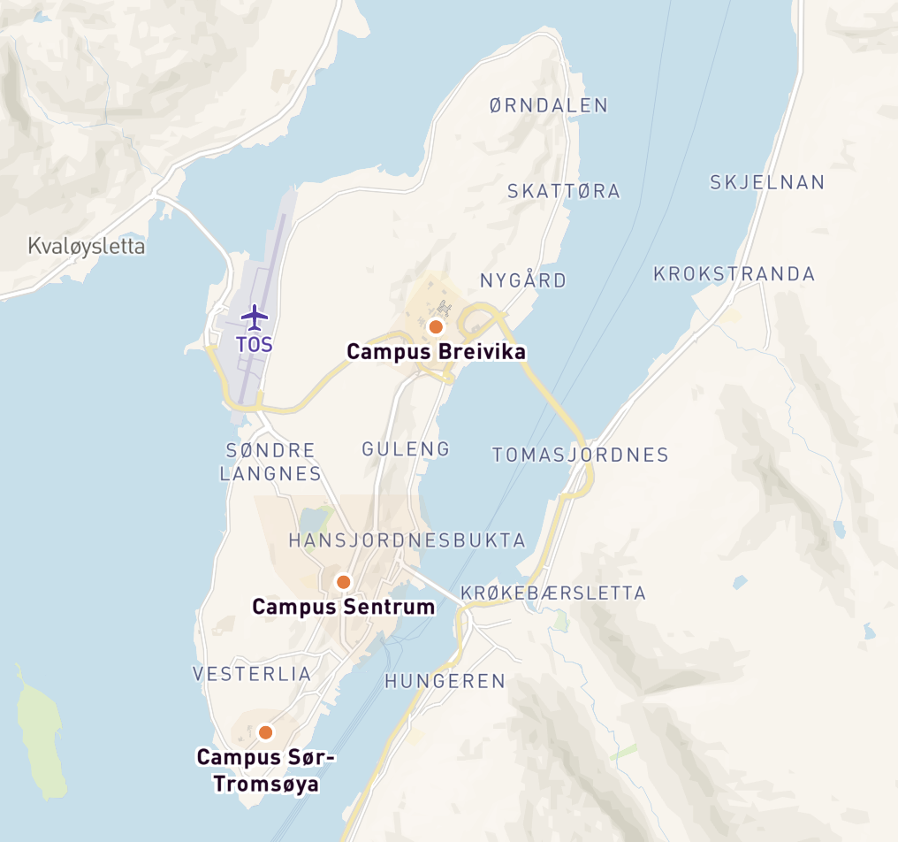

+++
title = "2026 Nordic-RSE Conference"
+++

# Welcome

Join us for the Nordic-RSE Conference 2026, bringing together Research Software Engineers from across the Nordic region and beyond for two days of learning, networking, and collaboration.

**Dates:** June 9-10, 2026  
**Location:** [Auditorium Cerebrum, UiT - The Arctic University of Norway, Tromsø](#venue)  
**Times:** [9:00 - 16:00 each day](#schedule)

This community-driven conference is for anyone working at the interface between research and digital technologies - from software developers and data scientists to system administrators and research supporters.

{{ new_block() }}

# About the Conference {#about}

Nordic-RSE is a grass-root professional association providing a networking platform for Research Software Engineers in the Nordic region. The 2026 conference features a unique two-day format:

**Day 1 (June 9):** Focused sessions for the RSE community - share experiences, discuss best practices, and connect with fellow RSEs.

**Day 2 (June 10):** Open to the broader community including students, researchers, and private companies - learn about research software engineering and its impact across sectors.

Whether you're an experienced RSE or just getting started with writing scientific software and scripts, this conference offers valuable insights and networking opportunities.

{{ new_block() }}

# Important Dates

**Call for Participation:** Opens February 2026

**Conference Dates:** June 9-10, 2026

*Detailed dates will be announced soon. Stay tuned!*

{{ new_block() }}

# Venue {#venue}

The conference will be held at [**Auditorium Cerebrum** at UiT - The Arctic University of Norway in Tromsø](https://link.mazemap.com/CUiXs19U) .

**Address:**

UiT - The Arctic University of Norway  
Universitetsvegen 61  
9019 Tromsø  
Norway

[Google Maps link](https://maps.app.goo.gl/YCQriKUMACmXu7Qp6)

### Getting to UiT:
- **By Air:** Tromsø Airport (Langnes) is located about 5 km from the city center. Local buses and taxis connect the airport to the city and university.
- **By Bus:** Public transportation serves the university campus. Check [Tromsø public transport](https://www.tromskortet.no/) for routes and schedules.
- **Parking:** Limited parking is available on campus.

More detailed directions and campus maps will be provided closer to the conference date.

{{ new_block() }}

# Schedule {#schedule}

The conference runs from **9:00 to 16:00** on both days.

### What to Expect:
- Keynote presentations from invited speakers
- Technical talks and demonstrations
- Discussion sessions and panels
- Poster presentations
- Networking opportunities
- Coffee breaks, lunch, and afternoon refreshments included

### Conference Format:
- **Day 1 (June 9):** Open sessions for students, researchers, and industry partners
- **Day 2 (June 10):** RSE-focused sessions for practitioners and community members

The detailed program will be published after the call for participation closes and submissions are reviewed.

{{ new_block() }}

# Accommodation {#accommodation}

We have arranged special accommodation options for conference participants:

## UiT Student Housing (Recommended)

**20 rooms reserved** from June 8-14, 2026 at Samskipnaden student housing.
Unfortunately, it is only possible to book the rooms for a minimum of 7 days.

- **Type:** Shared dormitory (dublett) with common bathroom and kitchen
- **Price:** 2800 NOK for the whole week.
- **Included:** Clean linen, towels, basic kitchenware, WiFi, laundry facilities

This is an excellent budget option that keeps you close to other conference participants.
Especially, if you want to combine the conference with a vacation to explore Tromsø and Northern Norway.

## Hotels in Tromsø

Tromsø offers lots of hotels, just check the typical booking pages for offers.
Usually, the prices are reasonable in the summer time.

We will update this section with more hotel options and potential conference rates soon.

## Small Apartment Option

For families or those needing accessible accommodation:
- **Type:** Small 2-bedroom apartment (wheelchair accessible)
- **Price:** 3000 NOK per week (minimum 7 nights)
- **Availability:** 1 unit available

{{ new_block() }}

# Getting to Tromsø

Tromsø is located in Northern Norway, 350 km north of the Arctic Circle.

### By Air:
- **Tromsø Airport (TOS)** has direct flights from Oslo, Bergen, Trondheim, and other major Nordic cities
- International connections typically route through Oslo
- The airport is 5 km from the city centre

### Getting Around Tromsø by Public Transportation:

Getting around Tromsø is easy with public buses:

- Web page: https://svipper.no/
- **Ticket App:** Download the **Svipper** app for <a href="https://play.google.com/store/apps/details?id=no.trfylke.svipper.production" target="_blank" rel="noopener">Android</a> or <a href="https://apps.apple.com/no/app/svipper/id6502283055?l=nb" target="_blank" rel="noopener">iOS</a>
- **Ticket Prices:**
  - Week pass: 311 NOK (recommended for conference attendees)
  - Single ticket: 48 NOK
  - Off-peak single ticket: 26 NOK
- **Coverage:** The ticket zone covers the greater Tromsø area, allowing you to travel freely throughout the city and surrounding areas

**Travel Times by Bus:**
- Airport to UiT Campus (Breivika): ~25 minutes
- Airport to City Centre: ~25 minutes
- City Centre to UiT Campus: ~10-15 minutes

**Other Transportation:**
- **Taxi:** Tromsø Taxi at +47 776 03 000
- **Walking:** Tromsø city centre is compact and very walkable

{{ new_block() }}

# Things to Do in Tromsø

Tromsø offers a unique blend of Arctic nature and urban culture. Extend your stay to experience:

**Nature & Adventure:**
- Midnight Sun (visible late May through late July - perfect timing for our conference!)
- Hiking trails with stunning views (Sherpa Trappa, Varden)
- Kayaking and boat tours
- Wildlife experiences

**Culture & City Life:**
- Arctic museums and galleries
- Sami cultural experiences
- City center exploration with cafes, restaurants, and shops
- Historic wooden architecture

**Organized Activities (To Be Confirmed):**
- Sherpa Trappa hike
- Varden viewpoint visit
- Guided city tour

For comprehensive tourist information, visit [Visit Tromsø](https://www.visittromso.no/).

**Dress for Arctic Summer:**
Even in June, bring layers and prepare for variable weather. Temperatures are mild but can be cool, especially in the evening.

{{ new_block() }}

# Catering

All conference participants will enjoy full catering on both days.

- Morning coffee and refreshments
- Lunch each day
- Afternoon cake and coffee

**Plus social dinner (BBQ if the weather permits) on day 1**

Graciously covered by the UiT IT Department for all registered participants.

Dietary requirements will be collected during registration to accommodate all participants.

{{ new_block() }}

# Social Program

Beyond the formal sessions, we're planning social activities to help you connect with fellow RSEs:

**Conference Dinner:**
- **Venue:** BFE Naust (to be confirmed)
- **Date:** Evening of June 9 or 10 (to be announced)

**Optional Activities:**
- Sherpa Trappa hike
- Varden viewpoint excursion
- Tromsø city guided tour

Details about timing, costs, and registration for social activities will be announced closer to the conference date.

{{ new_block() }}

# Organizers

The Nordic-RSE Conference 2026 is organized by volunteers from the Research Software Engineering community. Organizing committee members will be listed here soon.

For questions or inquiries, please contact: **secretary@nordic-rse.org**

{{ new_block() }}

# Sponsors

If your organization is interested in sponsoring Nordic-RSE 2026, please contact secretary@nordic-rse.org.

{{ new_block() }}

# Contact {#contact}

**General Inquiries:** secretary@nordic-rse.org

**Accommodation Booking:** uit.housing@samskipnaden.no

**Follow Nordic-RSE:**
- Website: [nordic-rse.org](https://nordic-rse.org)
- GitHub: [github.com/nordic-rse](https://github.com/nordic-rse)

We look forward to seeing you in Tromsø in June 2026!

<!--
{{ new_block() }}

# List of Speakers (Template for later use)

{{ grid(
    text = [
        ["Speaker A","Institution A"], 
        ["Speaker B","Institution B"],
        ["Speaker C","Institution C"],
        ["Speaker D","Institution D"],
        ["Speaker E","Institution E"],
    ],
    urls = [
        "https://aterenin.github.io/academic-workshop#speaker_a",
        "https://aterenin.github.io/academic-workshop#speaker_b",
        "https://aterenin.github.io/academic-workshop#speaker_c",
        "https://aterenin.github.io/academic-workshop#speaker_d",
        "https://aterenin.github.io/academic-workshop#speaker_e",
    ],
    images = [
        "placeholder.svg",
        "placeholder.svg",
        "placeholder.svg",
        "placeholder.svg",
        "placeholder.svg",
    ],
    narrow = true) }}

{{ new_block() }}

# List of Organizers

{{ grid(
    text = [
        "Organizer A",
        "Organizer B",
    ],
    image_dir = "organizers") }}

{{ new_block() }}

# Schedule

| Time             | Event            |
| ---------------- | ---------------- |
| 12:00pm - 1:00pm | Introduction and Opening Remarks: Speaker Name A     |
| 1:00pm - 2:00pm  | Speaker A        |
| 2:00pm - 3:00pm  | Speaker B        |
| 3:00pm - 4:00pm  | Discussion Panel |

{{ new_block() }}

# Accepted Papers

{{ table(
    data = "papers.csv", 
    columns = ["Title","Authors"],
    button_names = ["paper","poster"], 
    button_data_columns = [3,4], 
    button_output_columns = [1,1]) }}

{{ new_block() }}

# Upcoming Seminar

{{ highlights(section_name = "seminars") }}

{{ new_block() }}

# List of Seminars

{{ list(section_name = "seminars") }}

{{ button(name = "All Seminars", url = "seminars")}}

-->
