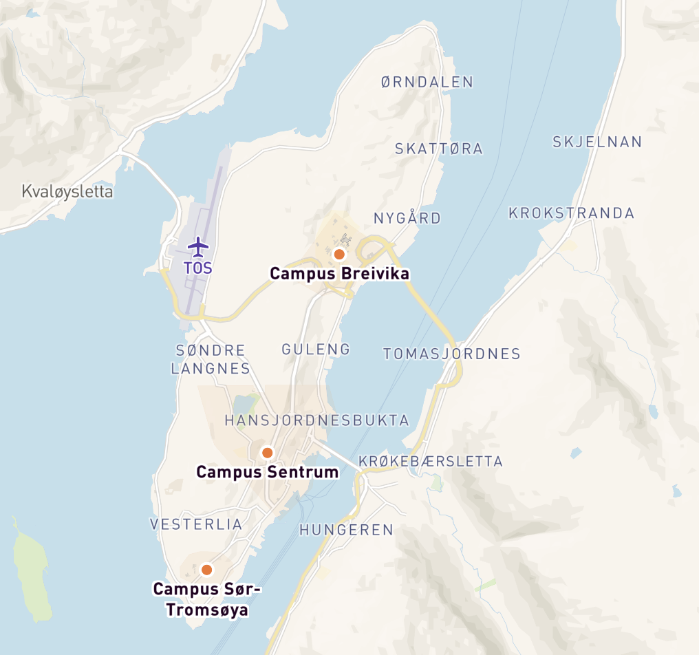

+++
title = "2026 Nordic-RSE Conference"
+++

# Welcome

<!-- Are you passionate about research software? Whether you develop research tools, support scientific software, or are simply curious about how good code makes research better — this is the perfect space for you.  -->
Join us for two days of learning, networking, and connecting with people who care about research software at the Nordic Research Software Engineering Conference.

**Dates:** June 9-10, 2026  
**Location:** [Auditorium Cerebrum, UiT - The Arctic University of Norway, Tromsø](#venue)  
**Times:** [9:00 - 16:30 each day](#schedule)

<!-- This community-driven conference is for anyone working at the interface between research and digital technologies - from software developers and data scientists to system administrators and research supporters. -->
The 2026 edition of the Nordic-RSE conference is organized by Nordic-RSE and UiT - The Arctic University of Norway.

    
    

{{ new_block() }}

# About the Conference {#about}

We believe the code supporting research deserves as much attention as the results it produces. Unlike traditional academic conferences that focus on research results, we focus on the tools, practices, and challenges that enable those results.

**Who Should Attend?**

**Probably you**, if you are passionate about research software. Whether you develop research tools, support scientific software, or are simply curious about how good code makes research better — this is the perfect space for you. 
We welcome researchers, students, developers, data scientists, system administrators, and anyone else interested in research software, regardless of background.

The 2026 conference features a two-day format:

**Day 1 (June 9):** Open to the broader community including students, researchers, and private companies - learn about research software engineering and its impact across sectors.

**Day 2 (June 10):** Focused sessions for the RSE community - share experiences, discuss best practices, and connect with fellow RSEs.

### Register for the conference [here](https://indico.neic.no/event/290/registrations/208/) (Registration Fee: € 25,-).
{{ new_block() }}

# Invited Speakers {#speakers}

    

        
        

            <h3><a href="https://www.rse.ox.ac.uk/dr-mihaela-duta" target="_blank">Dr. Mihaela Duta </a></h3>
            
<em>Principal Research Software Engineer at the University of Oxford</em>

            
Mihaela Duta leads the service provision for <a href="https://www.rse.ox.ac.uk/" target="_blank">OxRSE </a> and contributes to shaping research software strategy across the University of Oxford. She specialises in data science and applied software engineering, with particular expertise in interactive visualisation dashboards, data processing pipelines, mobile and web applications, and instrument control. She is also the co-founder of <a href="https://oxedandassessment.com/" target="_blank">OxEd and Assessment</a>, work that was Highly Commended in the <a href="https://www.ox.ac.uk/research/recognition/vice-chancellors-innovation-engagement-awards" target="_blank">2022 Vice-Chancellor’s Innovation and Engagement Awards</a> for making a positive difference to society.

Mihaela also helped professionalize the <a href="https://en.uit.no/infrastruktur/enhet?p_document_id=910823" target="_blank">RSE group at UiT</a> by providing valuable advice on the group's organisational structure, workflows and outreach activities.

        

    

    

        
        

            <h3><a href="https://en.uit.no/ansatte/person?p_document_id=834826" target="_blank">Assoc. Prof. Dr. Elisabeth Wetzer </a></h3>
            
<em>Associate Professor in Machine Learning at UiT The Arctic University of Norway</em>

            
Elisabeth Wetzer is a principal investigator at the Centre for Research-based Innovation, <a href="https://www.visual-intelligence.no/" target="_blank">SFI Visual Intelligence</a>, and the Centre of Excellence, <a href="https://www.integreat.no/" target="_blank"> SFF Integreat</a>. Her research spans biomedical applications, including microscopy, spatial biology, and medical imaging techniques such as dynamic PET, mammography, and echocardiography. 

Together with Assoc. Prof. Dr. Kristoffer Wickstrøm, she started a Research Software Engineering course (<a href="https://github.com/FYS-8805-Collaborative-Coding/lecture-material" targe="_blank">FYS-8805 Collaborative Coding and Reproducible Research</a>)  for PhD students at UiT.

        

    

        
        

            <h3><a href="https://radovan.xyz/" target="_blank">Dr. Radovan Bast</a></h3>
            
<em>Senior Scientist at Oceanbox</em>

        

Radovan Bast is a theoretical chemist by education and research software
engineer by heart who has been jumping a bit between research, computation,
programming, teaching, academia, and industry, and enjoys working somewhere
in-between all of these with focus on reproducibility and modular code
development.

Currently he is working at an oceanography start-up and having fun with
computational geometry and computational fluid dynamics, Rust, Python,
WebAssembly, and algorithms.

During his time at UiT The Arctic University of Norway, where he worked with
the High Performance Computing Group, Radovan founded UiT's <a
href="https://research-software.uit.no" target="_blank">Research Software
Engineering Group</a> and started the <a href="https://coderefinery.org"
target="_blank">CodeRefinery project</a>. He is one of the founding members of
the <a href="https://nordic-rse.org/" target="_blank">Nordic Research Software
Engineer community</a>.
        

        

    

{{ new_block() }}

# Important Dates {#abstract}

**Call for Abstracts:** Deadline April 27, 2026

**Registration**: Deadline May 24, 2026

**Conference Dates:** June 9-10, 2026

{{ new_block() }}

# Call for Abstracts 

**The abstract submission deadline has now passed.** We are currently reviewing the submissions and will notify authors of acceptance soon.

You can still submit an abstract for the poster session until May 24, 2026 via sending an email to **secretary@nordic-rse.org** including the title, authors and abstract.

{{ new_block() }}

# Need another reason to come?

The next **LUMI AI Workshop** will be hosted at UiT on **June 11-12, 2026**, immediately following the Nordic-RSE Conference. For more information and registration links, visit the [workshop website](https://lumi-supercomputer.eu/events/moving-your-ai-training-jobs-to-lumi-a-hands-on-workshop-june2026/).

{{ new_block() }}

# Venue {#venue}

The conference will be held at [**Auditorium Cerebrum** at UiT - The Arctic University of Norway in Tromsø](https://link.mazemap.com/CUiXs19U) .

**Address:**

UiT - The Arctic University of Norway  
Universitetsvegen 61  
9019 Tromsø  
Norway

[Google Maps link](https://maps.app.goo.gl/YCQriKUMACmXu7Qp6)

The route from the UiT bus stop to the auditorium is shown on this [map](https://drive.google.com/file/d/1xG1eiQd-h7IKuhQI5detNc5uMaUxEJZP/view?usp=sharing). If you have any trouble finding the venue or need to contact the organizers in an emergency, please call Binod Baniya at **+47 46578763**.

### Getting to UiT:
- **By Air:** Tromsø Airport (Langnes) is located about 5 km from the city center. Local buses and taxis connect the airport to the city and university.
- **By Bus:** Public transportation serves the university campus. Check [Tromsø public transport](https://www.tromskortet.no/) for routes and schedules.
- **Parking:** Limited parking is available on campus.

More detailed directions and campus maps will be provided closer to the conference date.

{{ new_block() }}

# Schedule {#schedule}

The **provisional schedule** can be found on the [**Indico conference page**](https://indico.neic.no/event/290/timetable/#20260609), and will be updated as we finalize the program.

{{ new_block() }}

# Catering

All conference participants will enjoy full catering on both days.

- Morning coffee and refreshments
- Lunch each day
- Afternoon cake and coffee

Generously provided by the [UiT IT Department](https://uit.no/enhet/ita) for all registered participants

**Conference BBQ:**
- **Venue:** BFE Naust (to be confirmed)
- **Date:** Evening of June 9 or 10 (to be announced)

Generously sponsored by [Oceanbox.io](https://oceanbox.io/)

Dietary requirements will be collected during registration to accommodate all participants.

{{ new_block() }}

# Accommodation {#accommodation}

We have arranged special accommodation options for conference participants:

## UiT Housing (Recommended)

**20 rooms reserved** from June 8-14, 2026 at the guest accommodations on campus.
Unfortunately, it is only possible to book the rooms for a minimum of 7 days.

- **Type:** Shared dormitory (private bedroom, bathroom and kitchen shared with one other person).
- **Price:** 2800 NOK (ca. € 250,-) for the whole week.
- **Included:** Clean linen, towels, basic kitchenware, WiFi, laundry facilities

**One small apartment** from June 8-14, 2026 at the guest accommodations on campus.
For those needing accessible accommodation.

- **Type:** Small 2-bedroom apartment (wheelchair accessible)
- **Price:** 3500 NOK (ca. € 310,-) for the whole week.
- **Included:** Clean linen, towels, basic kitchenware, WiFi, laundry facilities

This is an excellent budget option that keeps you close to other conference participants.
Especially, if you want to combine the conference with a vacation to explore Tromsø and Northern Norway.

These options can be requested during conference registration, and rooms will be assigned on a first-come, first-served basis

## Hotels in Tromsø

Tromsø offers lots of hotels, just check the typical booking pages for offers.
Usually, the prices are reasonable in the summer time.

{{ new_block() }}

# Getting around in Tromsø

Tromsø is located in Northern Norway, 350 km north of the Arctic Circle.

<!-- ### By Air: -->
<!-- - **Tromsø Airport (TOS)** has direct flights from Oslo, Bergen, Trondheim, and other major Nordic cities -->
<!-- - The airport is 5 km from the city centre -->

### Public Transportation:

Getting around in Tromsø is easy with public buses:

- Web page: https://svipper.no/
- **Ticket App:** Download the **Svipper** app for <a href="https://play.google.com/store/apps/details?id=no.trfylke.svipper.production" target="_blank" rel="noopener">Android</a> or <a href="https://apps.apple.com/no/app/svipper/id6502283055?l=nb" target="_blank" rel="noopener">iOS</a>
- **Ticket Prices:**
  - Week pass: 311 NOK (recommended for conference attendees)
  - Single ticket: 48 NOK
  - Off-peak single ticket: 26 NOK
- **Coverage:** The ticket zone covers the greater Tromsø area, allowing you to travel freely throughout the city and surrounding areas

**Travel Times by Bus:**
- Airport to UiT Campus (Breivika): ~25 minutes
- Airport to City Centre: ~25 minutes
- City Centre to UiT Campus: ~10-15 minutes

**Other Transportation:**
- **Taxi:** Tromsø Taxi at +47 776 03 000
- **Walking:** Tromsø city centre is compact and very walkable

{{ new_block() }}
# Things to Do in Tromsø

Tromsø offers a unique blend of Arctic nature and urban culture. Extend your stay to experience:

**Nature & Adventure:**
- Midnight Sun (visible late May through late July - perfect timing for our conference!)
- Hiking trails with stunning views (Sherpatrappa, Varden)
- Kayaking and boat tours
- Wildlife experiences

**Culture & City Life:**
- Arctic museums and galleries
- Sami cultural experiences
- Historic wooden architecture
<!-- - City center exploration with cafes, restaurants, and shops -->

<!-- **Organized Activities (To Be Confirmed):** -->
<!-- - Sherpatrappa hike -->
<!-- - Varden viewpoint visit -->
<!-- - Guided city tour -->

For comprehensive tourist information, visit [Visit Tromsø](https://www.visittromso.no/).

**Dress for Arctic Summer:**
Even in June, bring layers and prepare for variable weather. Temperatures are mild but can be cool, especially in the evening.

{{ new_block() }}

# Sponsors

    
    
    

If your organization is interested in sponsoring Nordic-RSE 2026, please contact secretary@nordic-rse.org.

{{ new_block() }}

# Contact {#contact}

**General Inquiries:** secretary@nordic-rse.org

**Follow Nordic-RSE:**
- Website: [nordic-rse.org](https://nordic-rse.org)
- GitHub: [github.com/nordic-rse](https://github.com/nordic-rse)

We look forward to seeing you in Tromsø in June 2026!

<!--
{{ new_block() }}

# List of Speakers (Template for later use)

{{ grid(
    text = [
        ["Speaker A","Institution A"], 
        ["Speaker B","Institution B"],
        ["Speaker C","Institution C"],
        ["Speaker D","Institution D"],
        ["Speaker E","Institution E"],
    ],
    urls = [
        "https://aterenin.github.io/academic-workshop#speaker_a",
        "https://aterenin.github.io/academic-workshop#speaker_b",
        "https://aterenin.github.io/academic-workshop#speaker_c",
        "https://aterenin.github.io/academic-workshop#speaker_d",
        "https://aterenin.github.io/academic-workshop#speaker_e",
    ],
    images = [
        "placeholder.svg",
        "placeholder.svg",
        "placeholder.svg",
        "placeholder.svg",
        "placeholder.svg",
    ],
    narrow = true) }}

{{ new_block() }}

# List of Organizers

{{ grid(
    text = [
        "Organizer A",
        "Organizer B",
    ],
    image_dir = "organizers") }}

{{ new_block() }}

# Schedule

| Time             | Event            |
| ---------------- | ---------------- |
| 12:00pm - 1:00pm | Introduction and Opening Remarks: Speaker Name A     |
| 1:00pm - 2:00pm  | Speaker A        |
| 2:00pm - 3:00pm  | Speaker B        |
| 3:00pm - 4:00pm  | Discussion Panel |

{{ new_block() }}

# Accepted Papers

{{ table(
    data = "papers.csv", 
    columns = ["Title","Authors"],
    button_names = ["paper","poster"], 
    button_data_columns = [3,4], 
    button_output_columns = [1,1]) }}

{{ new_block() }}

# Upcoming Seminar

{{ highlights(section_name = "seminars") }}

{{ new_block() }}

# List of Seminars

{{ list(section_name = "seminars") }}

{{ button(name = "All Seminars", url = "seminars")}}

-->
